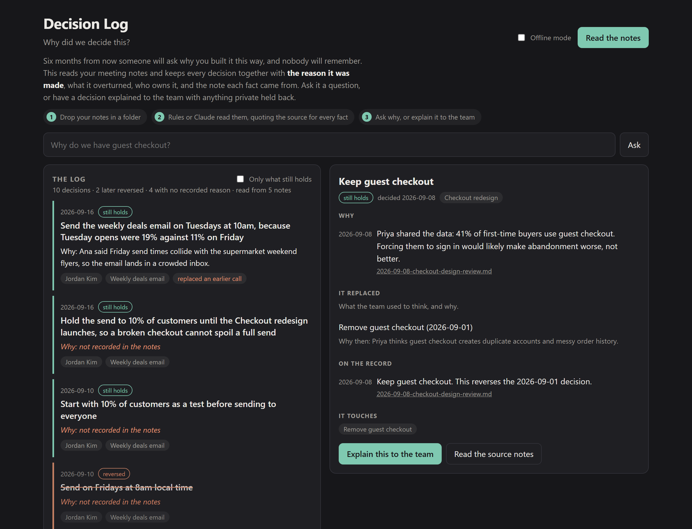

# Inspired Products

Products I built to understand how the ones I admire work.

Each project starts with something good that already exists, takes the idea worth learning from, and rebuilds a small honest version of it from scratch. The point is not to clone anything: it is to find out what a product is really made of by making one.

- **Product management:** Turn problems into products, test hypotheses, and evaluate trade-offs.
- **Ad tech:** Understand advertising systems, campaign performance, and measurement.
- **Data science:** Explore data, uncover patterns, and interpret results.

## Explore the projects

| Project | What you can learn | Open it |
| --- | --- | --- |
| **Campaign Lab** | Practice Instagram campaign decisions, compare one-variable experiments, and trace why simulated results changed. | [Source and instructions](apps/campaign-lab/) · [Web app](https://campaign-lab-instagram.basanti-nashine.chatgpt.site) |
| **LinkedIn Post Coach** | Design an AI review rubric, preserve an author's voice, and evaluate whether feedback is useful and grounded in the draft. | [Instructions and examples](agents/linkedin-post-coach/) |
| **Product Sense Mock** | Practice product sense and AI PM interviews against a tool-using agent that probes your answers and scores each stage for your level. AI PM interviews include a live prompt demo you narrate. | [Source and instructions](agents/product-sense-mock/) |
| **Decision Log** | Turn meeting notes into a log that answers "why did we decide this?". Learn how AI memory is built, why every fact needs a source, and how to keep private notes out of what you share. | [Source and instructions](agents/decision-log/) |

Campaign Lab currently runs in the browser using a fictional simulation. A backend, saved event dataset, and database are future learning milestones, not implemented features.

Product Sense Mock runs on your own computer, in a local browser page or the terminal. It has an offline mode that needs no API key, and a live mode that calls the Anthropic API.

Decision Log runs on your own computer too, reading a folder of Markdown notes. It also has an offline mode built from rules alone, so you can compare what plain pattern matching manages against what Claude adds.



*Decision Log, reading the sample notes: ten decisions, two later reversed, four where nobody wrote down why.*


*Product Sense Mock, shown with a demo session and sample answers.*

## Repository structure

```text
inspired-products/
├── apps/
│   └── campaign-lab/
│       ├── .openai/hosting.json
│       ├── dist/
│       ├── tests/
│       ├── package.json
│       └── README.md
├── agents/
│   ├── linkedin-post-coach/
│   │   ├── AGENT.md
│   │   ├── examples/
│   │   ├── tests/
│   │   └── README.md
│   ├── product-sense-mock/
│   │   ├── context/
│   │   ├── tests/
│   │   ├── web/
│   │   ├── interview.py
│   │   ├── offline.py
│   │   ├── product_sense_mock.py
│   │   ├── session.py
│   │   ├── web.py
│   │   ├── requirements.txt
│   │   └── README.md
│   ├── decision-log/
│   │   ├── docs/
│   │   ├── sample-notes/
│   │   ├── tests/
│   │   ├── web/
│   │   ├── ask.py
│   │   ├── brain.py
│   │   ├── live.py
│   │   ├── notes.py
│   │   ├── offline.py
│   │   ├── share.py
│   │   ├── web.py
│   │   ├── requirements.txt
│   │   └── README.md
│   └── README.md
├── package.json
└── README.md
```

Each app or agent belongs in its own folder and documents its setup, assumptions, and limitations. Projects may use different languages and deploy independently: Campaign Lab is JavaScript, Product Sense Mock is Python, and LinkedIn Post Coach is prose you paste into a chat.

## Try LinkedIn Post Coach

Copy [the reviewer instructions](agents/linkedin-post-coach/AGENT.md) into a new ChatGPT conversation, then send your post draft. Add the intended reader and purpose if you know them. It returns strengths, up to three prioritized improvements, and claims to check. Ask for `feedback-and-rewrite` when you also want a revision.

This is a reusable instruction-based reviewer, not a hosted app or autonomous publishing agent. It needs access to ChatGPT, but no separate API key or LinkedIn connection. See the [setup guide](agents/linkedin-post-coach/) for an optional offline prompt builder and a worked example.

## Try Campaign Lab locally

From the repository root, with Python installed:

```sh
python -m http.server 4317 --directory apps/campaign-lab/dist
```

Open http://localhost:4317. Use a web server rather than opening the HTML file directly, because the app uses JavaScript modules.

With Node.js 18 or later installed, run the existing checks from the root:

```sh
npm test
npm run check
```

There are no npm dependencies to install for either project. Root commands run both projects' checks. These check code behavior; they do not evaluate a live model's editorial judgment.

## Try Product Sense Mock locally

From `agents/product-sense-mock`, with Python 3.10 or later:

```sh
python web.py
```

A browser tab opens at http://127.0.0.1:8765. Choose the offline script to try it with no API key and no dependencies. To be interviewed by Claude, install `requirements.txt` and set `ANTHROPIC_API_KEY` in the same terminal before starting the server. `python product_sense_mock.py` runs the same interview in the terminal. Its tests run with `npm run test:product-sense` from the root and need neither. See the [agent's README](agents/product-sense-mock/) for the rubric, the flags, and its limitations.

## Try Decision Log locally

From `agents/decision-log`, with Python 3.10 or later:

```sh
python web.py
```

A browser tab opens at http://127.0.0.1:8766. Press **Read the notes** and the sample notes become a log of ten decisions, two of which were later reversed. Offline mode needs no API key and no dependencies. For Claude to read the notes instead, install `requirements.txt`, set `ANTHROPIC_API_KEY` in the same terminal, and tick **Live mode**. Point it at your own notes with `--notes path/to/your/notes`.

Its tests run with `npm run test:decision-log` from the root and need no API key. See the [project's README](agents/decision-log/) for the note format, the privacy rules, and its limitations.

## Deployment

Each project owns its deployment settings. Campaign Lab's Sites manifest is at `apps/campaign-lab/.openai/hosting.json`; its `dist` directory is relative to that app folder. The existing Site ID and web address are preserved.

GitHub holds the collection. Sites uses a separate source repository for Campaign Lab, and a GitHub push does not automatically publish a new website version. For a Campaign Lab release, synchronize **the contents of `apps/campaign-lab/`** into the existing Campaign Lab Sites checkout, preserving its `.git` directory, then follow the Sites publishing workflow. Build or package from that standalone app checkout, not the collection root. Reuse the manifest's existing Site ID.

This reorganization changes source paths only; it does not require replacing or redeploying the currently published app. New projects should use separate hosting configurations and Site IDs.

## Add the next project

1. Create `apps/<app-name>/` or `agents/<agent-name>/`.
2. Include the code and a README explaining the problem, local setup, examples, and limitations.
3. Keep credentials out of Git and document any required environment variables.
4. Add the project to the table above. Add project-specific checks and deployment instructions as needed.

This repository is public: every tracked project shares that visibility. Keep private projects in separate private repositories.

**Explore the projects. Build something. Learn along the way.**
